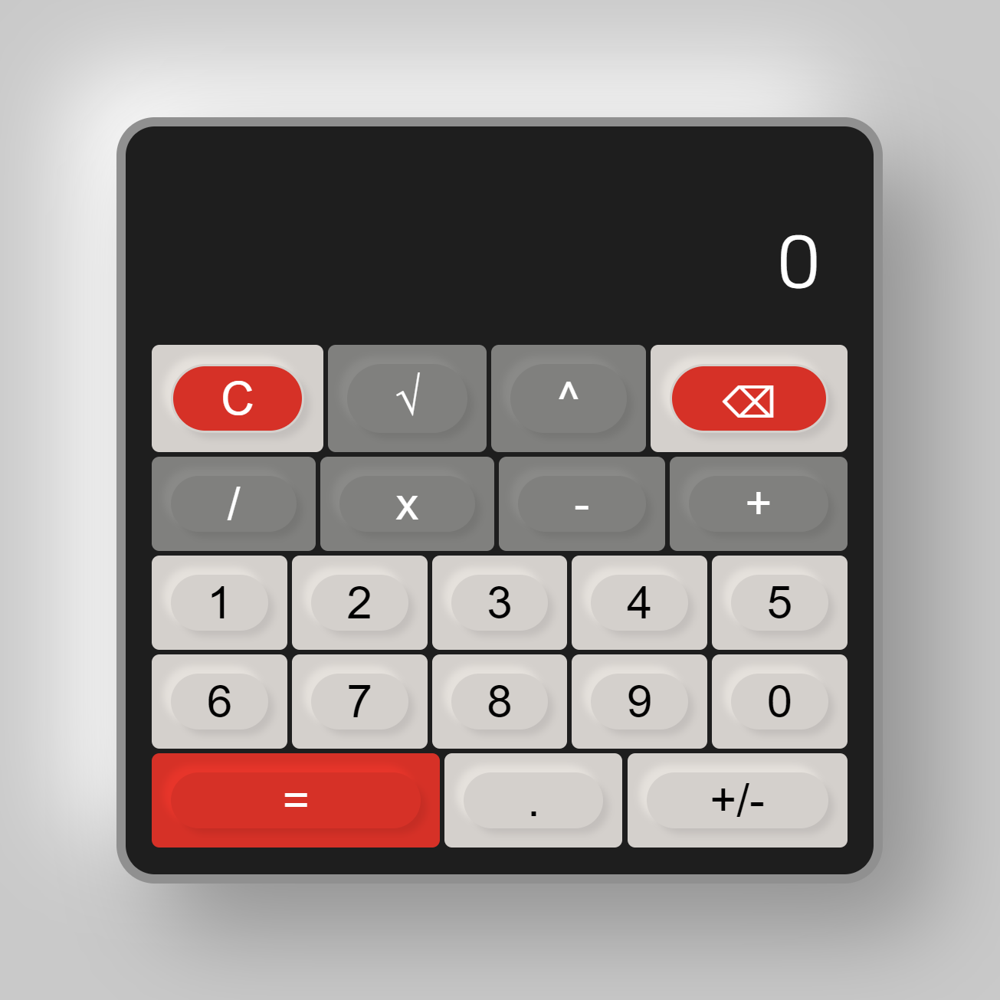

# Calculator

This is a calculator in neumorphism style which I created as a task for the Odin project.

It took longer than planned because I was concentrating too much on the design, but I'm very happy with the result.
Another difficulty in the development was the function to be able to continue calculating directly after a calculation or to start a new calculation by entering a new number.
I have solved this problem by querying the operator in the number input and if this corresponds to '=' the old number is no longer used.

Preview: https://lordofghost.github.io/Calculator/

## Credits

Icons: flaction.com

The design is strongly inspired by [Mirko Santangelo](https://www.figma.com/community/widget/1117624863659822884/calculator).
